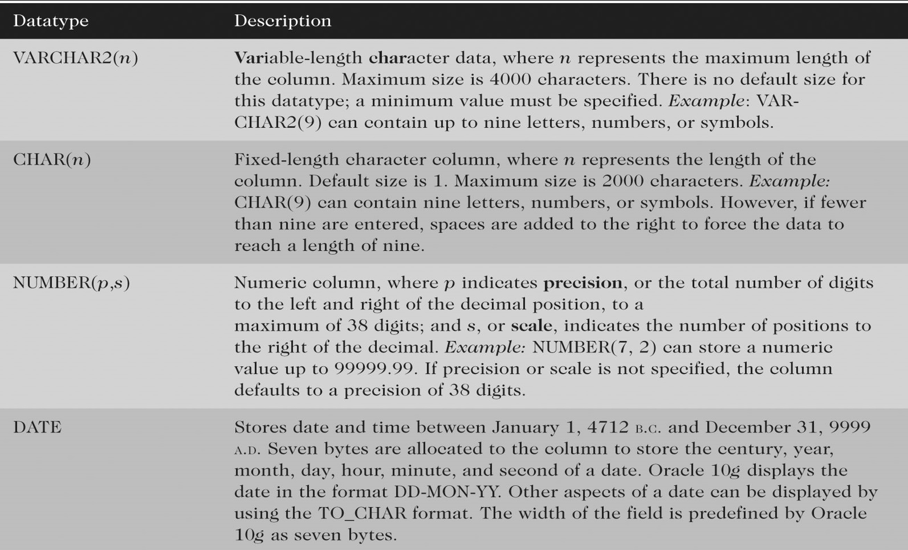

[Back](../index.md)

# Data Type

- [Data Type](#data-type)
    - [Data Type 数据类型](#data-type-数据类型)
    - [Display 显示](#display-显示)

---

## Data Type 数据类型

---

## Display 显示

- Alignment  不同的的数据类型有不同的对齐
   - Left-aligned 左对齐
       - text / character fields
        - date fields
    - Right-aligned 右对齐
        - numeric data

- Insignificant zeroes
    - By default, Oracle does not display insignificant zeroes.  i.e.: `54.50` => `54.5`

[TOP](#data-type)
