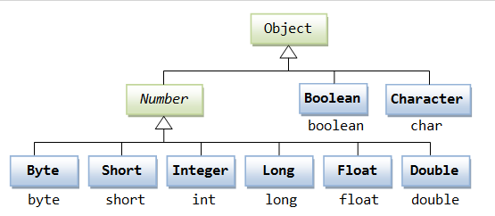
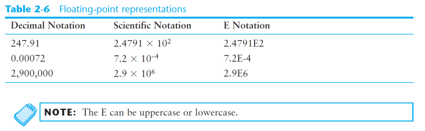

[Back to Java](../index.md)

[TOC]

***

# Data Type

## Primitive Data Types 原始数据类型

Primitive data types are built into the Java language and are not derived from classes.
内置非源于类的数据类型。

- There are 8 Java primitive data types.
    - byte 字节
    - short 短整数
    - int 整数
    - long 长整数
    - float 浮点
    - double 双精度浮点
    - boolean 布尔
    - char 字符



---

### Numeric Data Types


#### Integer Data Types 整数类型

- `byte`, `short`, `int`, and `long` are all integer data types.

- Integer data types cannot hold numbers that have a decimal point in them.

- Integers embedded into Java source code are called **integer literals**整数字面值.

#### Floating-Point Data Types 浮点类型

- Data types that allow fractional values are called **floating-point numbers**.

- In Java there are two data types that can represent floating-point numbers.
    - float- also called **single precision** (7 decimal points)
    - double - also called **double precision** (15 decimal points)

- When floating-point numbers are embedded into Java source code they are called **floating-point literals**浮点字面值.

- The **default data type for floating-point literals** is **double**.
    默认是双精度浮点

#### Scientific Notation 科学计数法

- Java uses `E` notation to represent values in scientific notation.
    即E+NUM表示10的指数
    e.g.:4.728197X10<sup>4</sup> == 4.728197E4



---

### Boolean Data Type 布尔值类型

- two possible values：
    - `true`
    - `false`

--- 

### Char Data Type 字符数据类型

- single characters 单个字符

- `char literals` are enclosed in **single quote marks**.
    字符值使用单引号

<font color="red">!important:
`char` literals are enclosed in **single quotes**.
`String` literals are enclosed in **double quotes**.
</font>

#### Unicode

- Character data in Java is stored as Unicode characters.
    本质上, 字符被储存为Unicode编码的数字。
&emsp;

- Each character takes up 2 bytes in memory.
    单字符占2字节内存。
    
---

## Conversion between Primitive Data Types 类型转换

- Java is a **strongly typed** language. 
    - Before a value is assigned to a variable, Java **checks the data types** of the variable and **the value being assigned** to it to determine if they are compatible.

- When you try to assign an **incompatible value** to a variable, an **error** occurs at compile-time.

- The Java primitive data types are ranked. 分等级


- **Widening conversions** are allowed.
    This is when a value of a lower-ranked data type is assigned to a variable of a higherranked data type.

```java

double x;
int y = 10;
x = y;      // Widening Conversion. 

```
以上: double类型是8 bytes, int是4 bytes,所以x有足够空间,无需要显式转换.

---

- **Narrowing conversions** are not allowed.
    This is when a value of a higher-ranked data type is assigned to a variable of a lowerranked data type.

    - **Cast Operators**
    Let you manually convert a value, even if it means that a narrowing conversion will take place.

```java

int x;
double y = 2.5;
// x = y;      //Narrowing Conversion
x = (int)y;     //(int) is cast operator

```
以上: double类型是8 bytes, int是4 bytes,所以x没有足够空间,需要显式转换y.

---

- **Mixed Integer Operations**
    - When values of the `byte` or `short` data types are used in arithmetic expressions, they are temporarily converted to `int` values. 
    `byte`和`short`的算术运算结果是`int`类型
    - The result of an arithmetic operation using only a mixture of `byte`, `short`, or `int` values will always be an `int`.
    `byte`, `short`,或 `int`的算术运算结果都是`int`
    &emsp;
    - Other Mixed Mathematical Expressions:
        - double => double
        - float => float
        - long => long

```java
short a;
short b = 3;
short c = 7;
// a = b + c;      //error, sum of two short is int, but a is short.
a = (short)(b + c);     //cast operator to convert int into short, which the type of a.

```

---


## Constants 常量

- can hold only a **single value**

- declared using the **keyword** `final`

- By convention, constants are all upper case and words are separated by the underscore character.
    常量名：大写+下横线

- Constants need not be initialized when declared; however, they must be initialized
before they are used or a compiler error will be generated.
    声明无需赋值,但使用之前赋值

- Once initialized with a value, constants cannot be changed programmatically.
    一旦赋值无法修改

```java
final double CAL_SALES_TAX = 0.0725;
```
