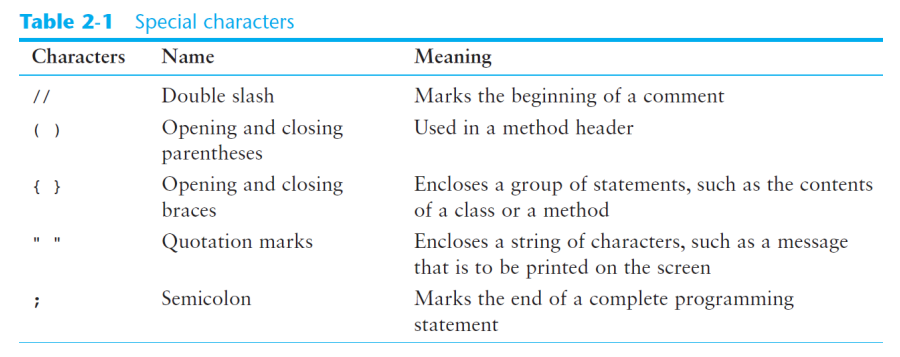
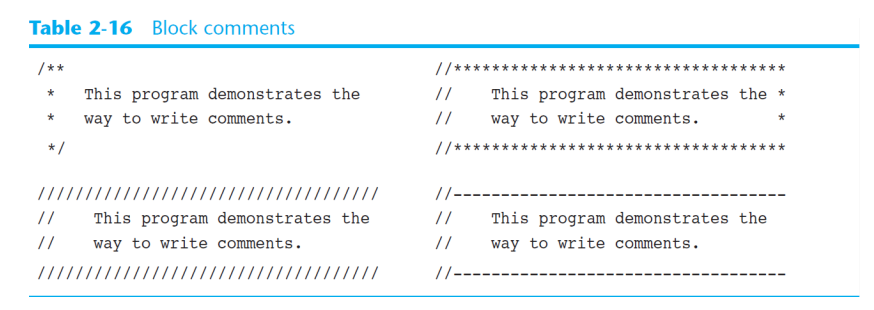
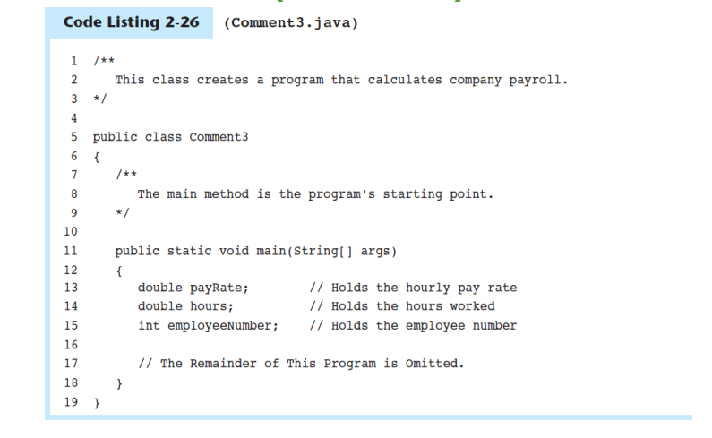

[Back to Java](../index.md)

[TOC]

---

# Java

## Java File Java 文件

- All Java programs must be stored in a file with a `.java` file extension.
  必须存放在以`.java`为扩展名的文件内。

## Java Language

- case-sensitive

- Comments are ignored by the compiler. 忽略注释。
- A `.java` file may contain many classes but may **only have one public class**.
  一个`.java`文件可以定义多个类，但只能有一个 public 类。
  即每个public类需要在其自身的.java文件中定义
  
- If a .java file has a public class, the class must have the same name as the file.
  public 类名=文件名
- Java applications must have a main method.
  程序必须有一个 main 方法
- Statements are terminated with semicolons, but **comments**, **class headers**, **method headers**, and **braces** are not.
  那些不需要分号结束



---

## Parts of a Java Program

```java

// comment
// Blank line
public class Simple     //Class Header, marks the beginning of a class definition
{       // opening brace
// CLass body
    public static void main(String[] args)      //Method header
    {       //Method body
        System.out.println("Hello world!");    // Statement
    }
}       // Closing brace

```

- `Comment`:

  - begin with double slash
  - The compiler ignores everything from the double slash to the end of the line. 编译器会忽略
  - help **explain** what is going on in the program.

- `Blank Line`: improve readability
- `Class Header`
  - marks the beginning of a class definition
  - tells the compiler that a publicly accessible class named Simple **is being defined**.
  - **A Java program must have at least one class definition.**
    一个程序包含至少一个类定义
- `Class body`:
  - Everything between the opening brace and closing brace is the body of the class named Simple.
- `Method header`:
  - marks the beginning of a method.
  - **Every Java application must have a method named main.**
    Java 程序有且只有一个 main
  - The main method is the **starting point** of the application.
- `Method body`:

  - Everything between the two braces is the **body** of the main method.
  - Make sure to have a closing brace for every opening brace in your program.

- `Satement`:
  - **A semicolon at the end of the line marks the end of a statement in Java**. 以分号结束
  - Not every line of code ends with a semicolon. 但不是所有行都需要分号结束.只有那些提交执行的 instruction 才要。
  - The **group of characters** inside the **quotation marks** is called a **string literal**字符串字面值.
    引号内的一组字符=字符串字面值

---

## Identifiers 标识符

标识符:即指定类、方法、变量的名字。

- Identifiers are programmer-defined names for:

  - classes
  - variables
  - methods

- Identifiers may **not be any of the Java reserved key words**.
  不能是保留的关键字

命名规则:

- An identifier may **only** contain:
  - letters a–z or A–Z,
  - the digits 0–9,
  - underscores ( \_ ), or
  - the dollar sign ( $ )
- The **first** character may **not be a digit**.
- Identifiers are **case sensitive**.
- Identifiers **cannot include spaces**.
- Variable names should **begin with a lower case letter** and then **capitalize the first letter** of each word thereafter
  小写跟首字大写

---

## Comments 注释

- Comments are:
  - notes of explanation that document lines or sections of a program.
    intended for people who may be reading the source code.
    作用：解释的记录，利于可读
- part of the program, but the compiler ignores them.
  是程序的一部分但会被编译器忽略

- In Java, there are three types of comments:
  - Single-line comments
  - Multiline comments
  - Documentation comments

### Single-line comments

Place two forward slashes (//) where you want the comment to begin.
以双斜杠开始

### Multiline Comments

- Start with `/*` (a forward slash followed by an asterisk) and end with `*/` (an asterisk followed by a forward slash).

- Can span multiple lines 可跨行

### Block Comments



- use asterisks or other characters to draw borders or boxes around their comments. 环绕

- This helps to visually separate the comments from surrounding code.
  便利于与代码区分。

### Documentation Comments



- The comment that starts with `/**` and ends with `*/` is considered a documentation comment.
  注意与 multiline 区分

- A documentation comment usually is placed before:

  - a **class header**, giving a **brief description of the class**.
  - each **method header**, giving a brief **description of the method**.
    用于描述类和方法

- Documentation comments can be read and processed by a program named **javadoc**, which comes with the Sun JDK. 与 javadoc 联结

  - The purpose of the javadoc program is to read Java source code files and **generate attractively formatted HTML files** that document the source code.

- To create the documentation:

```java
javadoc Comment3.java
```

- The javadoc program will create index.html and several other documentation files in the same directory as the input.

---

## Programming Style

- the way a programmer visually arranges a program’s source code.

