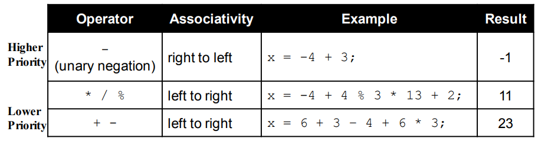
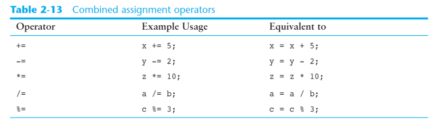

# Operator

[Back to Java](../index.md)

[TOC]

---

- Java divides the operators into the following groups:
    - Arithmetic operators
    - Assignment operators
    - Comparison operators
    - Logical operators
    - Bitwise operators

## Arithmetic Operators 算术运算符


- The operators are called **binary operators** because they must have two operands.
    二元运算符,与三元运算符相对
&emsp;
- It is an error to try to divide any number by zero.
    除法运算要注意被除数是否为零。dividend cant be zero.
&emsp;
- Integer division will truncate any decimal remainder.
    `1/2`的结果是`0`.

### Operator Precedence 运算符优先级



1. `-`: 负号最先
2. `* / %`
3. `+ -`

- When parenthesis are used in an expression, the inner most parenthesis are processed first.
    括号由内到外

- If two sets of parenthesis are at the same level, they are processed left to right.
    同级别的括号，由左到右

---

### Combined Assignment Operators



---

### Operator: `+`

- The + operator can be used in two ways.
  - as a concatenation operator 字符串连接符
  - as an addition operator 加法计算符

A string literal value cannot span lines in a Java source code file. The String concatenation operator can be used to fix this problem.
字符串不能跨行，因此加号能解决该问题。

e.g.:

```java

System.out.println("These lines are " +
                    "now ok and will not " +
                    "cause the error as before."
                    );

// The Concatenation operator can be used to format complex String objects.
// 用于处理复杂格式输出

System.out.println("The following will be printed " +
                    "in a tabbed format: " +
                    "\n\tFirst = " + 5 * 6 + ", " +
                    "\n\tSecond = " + (6 + 4) + "," +
                    "\n\tThird = " + 16.7 + "."
                    ); 

```

---

## Relational Operators/Comparison Operators 关系运算符

- **Comparison operators** are used to compare two values. 用于比较

- A **boolean expression** is any variable or
calculation that results in a `true` or `false`
condition. 关系运算符一般用于布尔表达式. 该表达式的结果是true或false.


|Relational Operator|Description|
|---|---|
|`>`|is greater than|
|`<`|is less than|
|`>=`|is greater than or equal to|
|`<=`|is less than or equal to|
|`==`|is equal|
|`!>`|is not equal to|

---

## Logical Operators

Logical operators are used to **determine the logic** between variables or values.

|Logical Operator|Description|
|---|---|
|`&&`|is greater than|


[TOP](#operator)
