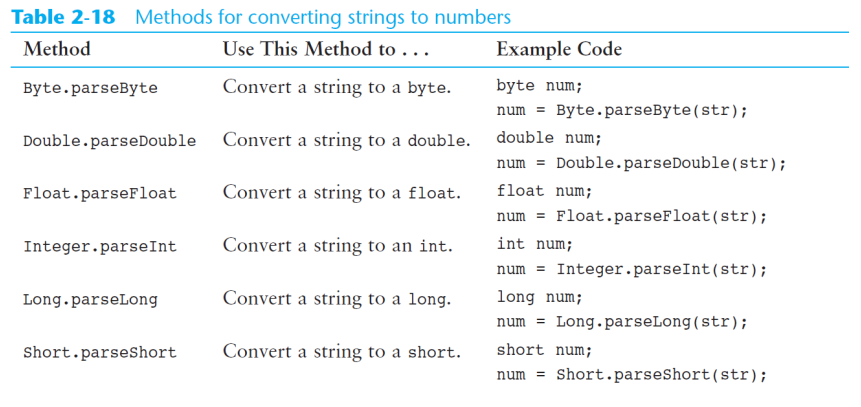

[Back to Java](../index.md)

[TOC]

---

# String Class

`String` class from the Java standard library is used to hold a series of characters.
    字符串是std包

- A string variable is created to reference a String object.
    字符串变量的本质是映射一个对象。
    
- 声明字符串类型必须是大写开头`String`

## Declearation and Assignment

1. A variable can be assigned a string literal.<br>
    String objects are the only objects that can be created in this way.
    字符串对象是唯一能使用等于号=直接赋值的对象。

```java
String value = "Hello";
```

2. using the new `keyword`

```java
String value = new String("Hello");
```

## Immutability 不可变性

- cannot be changed

- can create new versions of the object.

*应该理解为不可以直接改变或者不可以操作字符串去改变自己的初始的字符存储数组

*只要尝试改变值，都会产生新对象。

## Method

### .length()

`stringVar.length()`

---

## Converting String 转换字符串到其他类型



---

## String.format()

- 用来整理字符串的格式。


