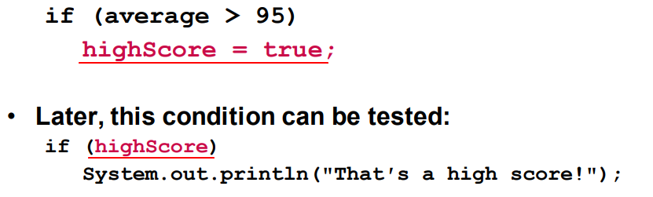

# IF STATEMENT

[Back to Java](../index.md)

[TOC]

---

## `if`

The `if` statement uses a <u>boolean</u> to decide whether the next statement or block of statements executes.

- Syntax:

```java

if (condition) {
  // block of code to be executed if the condition is true
}

```

- Note that `if` is in **lowercase letters**. Uppercase letters (If or IF) will generate an error. `if`是小写.

- the use of curly braces to block several statements together. `if`其后是多行代码的,使用大括号.

- Curly brace use is not required if there is only one statement to be conditionally executed. However, sometimes curly braces can help make the program more readable. 如果是一行代码的, 可以不用大括号. 但大括号可以令代码易读.

- Proper indentation makes it much easier to match up else statements with their corresponding if statement.正确的缩进,也提高易读性.尤其是

---

### Programming style

- Rules of thumb:

  - An `if` statement can span more than one line; however, it is still one statement. 对于 if 其后只有一行执行代码的,其实际上是一个 statement.
  - `if(condition)`:单独一行,不以 semicolon 结束
  - `onditionally executed statement`:
    - should be **on the line** after the if condition.另起一行
    - should be **indented one level** from the `if` condition 缩进
    - If an if statement **does not** have the block curly braces, it is ended by the first semicolon encountered after the if condition. 如果只有一行,则以分号结束.
    - If curly braces are used to **group** conditionally executed statements, the if statement is ended by the closing curly brace. 如果有大括号,以大括号结束.

- Remember that when the **curly braces are not used**, then **only the next statement** after the if condition will be executed conditionally.<font color="red">难点</font>

```java

if (expression)
  statement1;   //Only this statement is conditionally executed.
  statement2;
  statement3;

```

---

### Flags

了解即可

- A **flag** is a <u>boolean variable</u> that monitors some condition in a program. 旗标,用于监察条件.

  - When a condition is true, the flag is set to true.
  - The flag can be tested to see if the condition has changed.

  

---

### Comparing Characters 字符串比较

- Characters are stored in the computer using the **Unicode** character format. 字符串使用 Unicode 码储存.
  - Unicode is stored as a sixteen (16) bit number.16 进制
  - Characters are ordinal 序数, meaning they have an order in the Unicode character set. 即可以比较次序.

---

### Nested if Statements 嵌套

- If an if statement appears **inside** another if statement (single or block) it is called a **nested if statement**.
- The nested if is executed only if the **outer** if statement results in a `true` condition.

---

## `if-else`

The `if-else` statement adds the ability to conditionally execute code when the `if` condition is `false`.

- Syntax:

```java

if (condition) {
  // block of code to be executed if the condition is true
} else {
  // block of code to be executed if the condition is false
}

```

---

## `if-else-if`

- Syntax:

```java

if (condition1) {
  // block of code to be executed if condition1 is true
} else if (condition2) {
  // block of code to be executed if the condition1 is false and condition2 is true
} else {
  // block of code to be executed if the condition1 is false and condition2 is false
}

```

---

[TOP](#if-statement)
