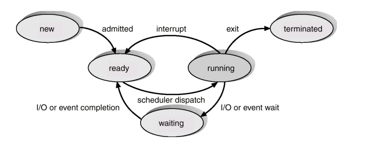

# Linux Process

[Back](../index.md)

[TOC]

---

## Process 进程

- **Process**: It is a program in execution, it is also known as an instance of a program..

  - When a process is started it **allocates memory** to the program for execution. This memory
    space allocated to the program is also known as an **instance of the program**. 进行即分配的内存,所以也被称为实例.

    - Every instruction is executed in the **primary memory** also known as a **buffer**. Nothing is executed on the secondary storage.  进程是在 primary memory 中执行,即缓存. 进程的执行不涉及次级储存.

  - Each process has a **process identification number (PID)** associated with it.

  - User interaction: When you ask for something to be done, you "**spawn** a new process".

    - `Spawn` in computing refers to a function that **loads** and **executes** <u>a new child process</u>.术语
    - When any new task needs to be performed in LINUX OS, a new process is spawned/created for allocating the memory to the program for execution. Spawn 涉及分配内存

  - The `kernel` controls and manages processes.
    - When you log in, the process running is normally a shell, called a **login shell**.
       

- **PID**: All processes have a process id or PID.
   

- **PPID**: Every process has a parent process (with a PPID).
  - `PPID` can be shared between multiple processes who belongs to same parent, but `PID` is always unique.
     

---

## Process Management

### Shell variable

**Shell environment variables** contain information about processes. 环境变量可以获取进程信息.

- The `$$` variable will hold your <u>current process ID</u>. Actually `$$` is a **shell parameter** and not a variable, you cannot assign a value to it. `$$`不能被赋值.
- `$PPID` contains the <u>parent PID</u>.

- 通常使用 echo 命令获取`$$`和`$PPID`.

### Parent and Child

- Processes have a **parent-child** relationship. **Every process has a parent process.**
   
- When starting a new bash you can use echo to verify that the pid from before is the ppid of the new shell. 每次开启一个`BASH shell`都建立在原有的 shell 上,所以新 shell 对话框的 PID 都比原有的对话框 PID 加 1.
- The child process from above is now the parent process.

- A child process is always spawned/started by a parent process.子进程总由父进程启动.

---

### Inter-process communication

- Two or more processes run at the same time.
- When two processes interact in some way, it is possible to arrange for one job to provide output to, or receive input from, another job. 两个进程之间的交流.

---

### Process State

- As a process executes, it changes state
  - `new`: The process is being created/spawned. 1st stage of a process.
  - `running`: Instructions are being executed/in execution.
  - `waiting`: An idle state of a process. The process is waiting for some event to occur.
  - `ready`: The process is waiting to be assigned to a process. Once it is out of waiting state and ready to be assigned to the events for execution.
  - `terminated`: The process has **finished** execution. When all of the instructions are executed and the process is **ready to be stopped or it can be killed** as well.
     

---

### Killing a Process

- **kill**: <u>a built-in command</u> which is used to **terminate processes manually**. When a process stops running, the process dies, when you **want a process to die**, you kill it. `kill`是用户手动杀死进程.

- Ways ot kill a process:
  - <kbd>Ctrl</kbd> + <kbd>C</kbd>: for a program that is running
  - `kill [PID]`: for a particular process
  - Close the window in which a program runs
  - Exit from the shell in which a program runs
  - Exit GUI entirely
  - Log out from session

---

## `init process`

- **`init`**: the **first process** to start when a computer <u>boots up and runs</u> until the system <u>shuts down</u>.

  - `init` stands for **initialization** to create processes from script stored in the file <u>/etc/inittab</u> which is a configuration file which is to be used by initialization system. 初始化,文件在`/inittab`

  - The `init process` is **started by** the <u>kernel</u> itself. Init serves as a <u>foster parent</u> for orphaned processes. Init process is always started by kernel not by any user. Most of the default processes are started by kernel not by any user. 由 kernel 启动,非用户启动,并衍生出其他进程.默认进程大多是由 kernel 启动.

  - It is the **last step** of the kernel boot sequence. 是启动的最后一步.

    - At this point, a `login` appears at the console.
       

- The `init process` has **`PID`** equal to `1`. 进程 ID 为`1`.

  - `ps -ef`的结果是 PID=1, UID=root, CMD=/sbin/init splash.
     

- The `init process` is **parent** of all Linux processes. 是所有进程的父进程.

  - Technically it **does not have a parent process**. 没有父进程
     

**Importance of init process**:作用

- It is responsible for opening all of the file streams in Linux. It starts the shell i.e. login shell.
   

- The `init process` initializes the system, starts another process to **open terminal lines**, and **sets the standard input (stdin), standard output (stdout), and standard error (stderr)**, which are all associated with the terminal. 初始化 stream.

---

## Daemon Process

- **Daemon**: <u>a computer program</u> that **runs indefinitely as a background process**, _rather than being under the direct control of an interactive user_. 在后台运行的程序.

  - A daemon is a program that after being **spawned**, either _at boot_ or by _a command from a shell_, **disconnects** itself from the terminal that started it and **runs in the background**.
  - These daemons never die. 不会死.
     

### To identify daemon processes

- The **names** of `daemons` conventionally end in **`d`**. 从名称上辨别:名称以`d`结尾

  - e.g.: inetd, httpd , nfsd , sshd , named, and lpd.
     

- 命令`ps -ef`:

  - A `?` symbol will be shown in the tty field of the command . tty 列的问号`?`的进程
     

- 命令`ps -xj`:

  - All the processes shown with `PPID 1` are daemon processes. PPID 值是 1 的进程.
     

- LINUX relies on many daemon processes to perform routine tasks.A `daemon` is just a process that **runs in the background**, usually **waiting for something to happen** that it is capable of working with. 角色: 等待事件,支持 Linux.

  - e.g.: a printer daemon is waiting for print commands.

- **Daemons** are <u>system-related background processes</u> that often run with the **permissions of root** and **services requests from other processes**. 权限: root, 相应其他进程.

---

## Zombie Process

- **zombie**: a process that **has completed execution** (via the exit system call) but **still has an entry in the process table**. 已完成执行或 kill,但依然存在的进程.

  - It is a **killed/dead process**, but it still **shows up in the system** and is eating up some of the resources.
  - This process is killed/dead but still visible in the listing, it is a kind of **defunctional process**.
  - When a process is **killed**, but it **still shows up** on the system, then the process is referred to as zombie.
  - It is a process in the "Terminated state".
  - You **cannot kill zombies**, because they are already dead.不能被杀死.

**To identify zombies**:

- 命令`ps -o pid,s,comm`:

  - `Status`: `Z` is a zombie.
     

**To kill zombies**:

- 命令`kill -9 PID`

---

## Background Process

**Types of processes in Linux**:

- **Foreground process**: They are always **in the foreground** and **runs on the screen**, and users start the foreground processes.
  e.g.: User launched any application, utility from Linux terminal(top command).

- **Background Process**: These processes are always **running in the background**, they are **not visible to the users**.
  e.g.: daemon processes in Linux, any internet security software’s such as antivirus running in the background

### Job

- **Job**: A job is a process that is **not running in the foreground** and **is accessible only at the terminal** with which it is associated, typically background or suspended processes. 不在前台,但可以通过与之关联的终端访问. 即可访问的后台程序.

### `&` ampersand

Processes that are started in background using the `&` character at the end of the command line are also visible with the jobs command. 在命令最后使用`&`, 表示进程在后台进行.

### Switch

- `Ctrl + Z`: Command to Switch a process from foreground to background

  - This sends a `SIGSTOP` signal to the Linux kernel, effectively freezing the operation of the process.
  - 被切换的进程, 在`jobs`的命令中会显示为 Stopped.

- `fg`: bring a background job to the foreground.

---

[TOP](#linux-process)
