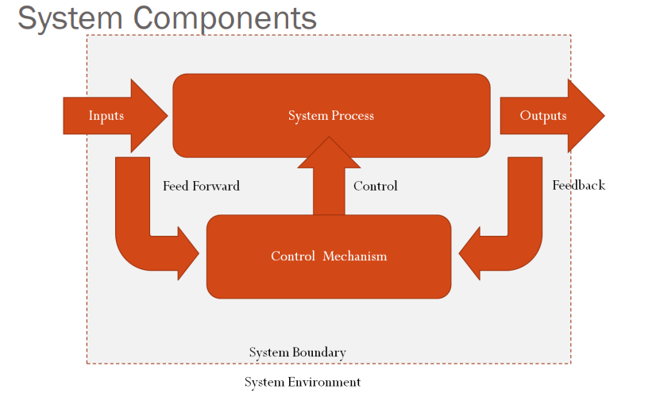
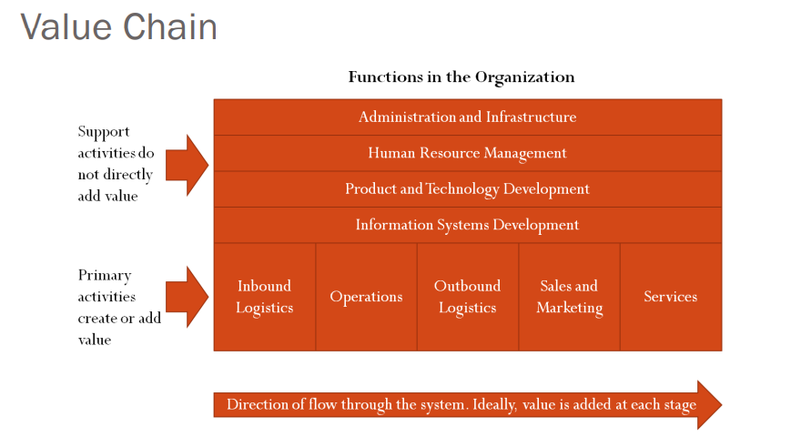
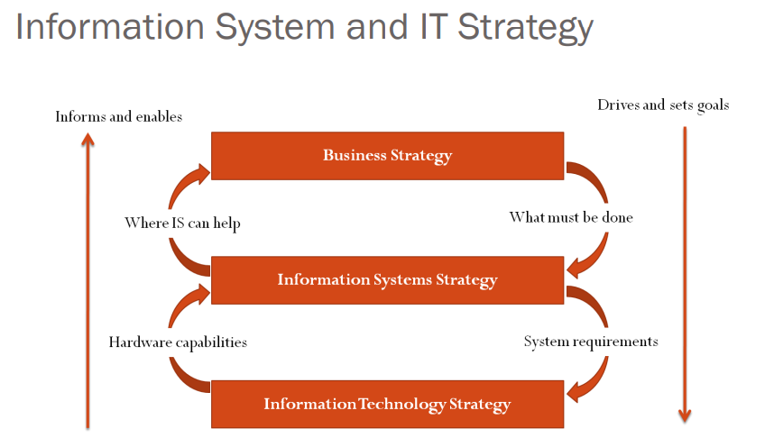

[Back](../index.md)

# Information Systems

[TOC]

***

## General System Theory

### Characteristics of a System

- Exists in an environment separated by a **boundary**

- There is **Inputs** and **Outputs** of a system

- **Interface** for intersystem communication

- **Subsystems**

- Control Mechanism based on **Feedback**

- **Emergent Properties**

---

#### System Boundary and Environment

- System and reality: System is the **map** not the terrain

- Systems can overlap

- System boundaries of disparate systems can overlap or coincide

- Boundary is to isolate system from environment. 

#### Input, output and interface

- Systems **interact** with their <u>environment</u>
    - Inputs
    - Outputs

- Black box Approach:What is known, How is NOT known

- One’s Output can be Others Input

#### Sub-Systems

- Subsystem: System(s) within System

- **Interfaces** may be used be subsystems to communicate with one another

- System and subsystem can be arranged in form of a **hierarchy**

#### Control Mechanism based on Feedback

- Control in systems 
**Specialist Subsystem controlling** the whole system’s operation

- Feedback
    - Output can be passed back to control unit 反馈
    - Negative Feedback 负反馈
        Maintains system’s equilibrium by opposing deviation from some norm
    - Positive Feedback 正反馈
        Reinforces deviation. Tends to increase movement away form equilibrium 

- Feed-Forward 向前反馈

    - Uses sampled inputs rather than output
        e.g.:Adjusting production volume based on the amount of orders rather than sales
    - More responsive to Environment fluctuation than feedback

#### Emergent Properties

- Feature or ability of the system **as a whole** that is not found in any subsystem
- Makes the system approach a **holistic** approach
    - Uses one picture or diagram to better understand the system

---

## Information and Information Systems

- Determine the **needs** the technology must serve
    - Identify IS supporting roles focusing on **Human Activity System’s Purpose**
    - Efficient use of information

### Systems of Interest

- The human Activity Systems
    - Centers on the **purpose** of activity
    - Participants may have disagreement regarding the purpose of the system 

- Information System
    - Constructed to help people in a human activity system to **achieve their goals**
    - Developed based on the **understanding of Human Activity System**

### Information

- Conveyed by message
- Has meaning
    - Depends on context
    - Depends on receivers perspectives
- Is filtered 

- What may become of Message?
    - Data – Not selected for **attention**
    - Capta – Selected for attention
    - Information – Selected for attention and have **meaning** within the **context** which is dependent on the observer
    - Knowledge – structured into more **complex meaning** related by a context
        i.e.: knowing what to do based on the message

### Information Systems

IS has become more integrated with one another, the **boundaries** are blurred. Therefore, it is hard to classify information systems

- Some aspects of the role of IS
    - Operational System
    - Management Support System
    - Realtime Control Systems

#### Operational System

- Automates the routine, day-to-day record keeping tasks
    e.g.:- Accounting System, personnel System

#### Management Support Systems

- More **complex** than Operational Systems
- Most **information** is used by management is obtained from **operational system**
- Mostly built in the top of Operational System
- Early MSS were made by adding MIS to the existing Operational Systems
- Enables Manager to **maximize the performance of an organizational subsystem**
- Crucial aspect – feedback or feed-forward provided

#### Real-time control Systems

- Directly controls a system’s operations
- Best considered as a control subsystem of a physical processing systems
- has **human operators**

### Contributions of IS

- Business Strategy：the actual goals and steps 
    Depends on the characteristics of the organization, its environment, the skills of its workforce, etc.

- Many ways in which IS can contribute to achievement of **business goals**
- Value Chain Analysis
    - Help understand what really matters to an organization
    - Provides a systematic view of the organization

## Information System and IT Strategy 

---

[TOC](#information-systems)
