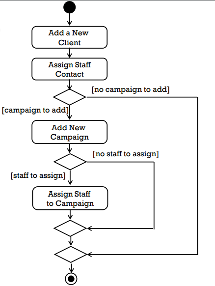
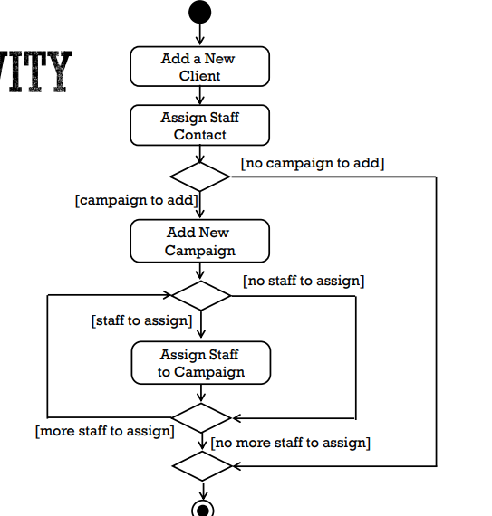
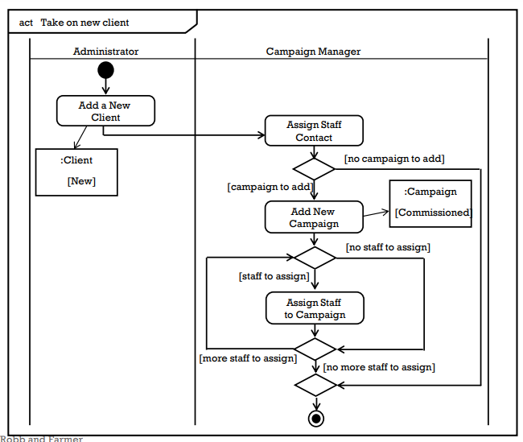

[Back](../index.md)

# Activity Diagram

[TOC]

---

## Purpose of Activity Diagram

- Purpose
    - to **model a task** (for example in business modelling)
    - to describe a **function** of a system represented by a **use case**
    - to describe the **logic** of an operation
    - to model the **activities** that make up the life cycle in the Unified Process

## The notation of activity diagrams

### Notation 标记

- Initial node
    - black circle 黑圆点

- Actions
    - rectangle with rounded corners 圆角矩形
    - meaningful name 以动词开头

- Control flows
    - arrows with open arrowheads 带箭头直线

- Decision nodes
    - diamond 菱形
    - if 判断

- Guard conditions
    - in square brackets 使用中括号包围
    - 用于描述判断的条件，跟在decision node旁

- Merge nodes
    - 分叉回合处

- Fork nodes
    - thick bar 粗横线

- Actions carried out in parallel 同时进行的动作

- Join nodes
    - thick bar 粗横线
    - 用于同时动作的回合处

- Final node
    - black circle in white circle 带圈的黑圆点

### Object对象

- Objects
    - rectangle 矩形
    - optionally shows the state of the object in square brackets 可选:使用方括号表示对象状态

- Object flows
    - open arrow

### Partitions参与者 

- Activity Partitions (Swimlanes)
    - vertical columns
    - labelled with the person, organisation, department or system responsible for the activities in that column

### Example

---

[TOP](#activity-diagram)
