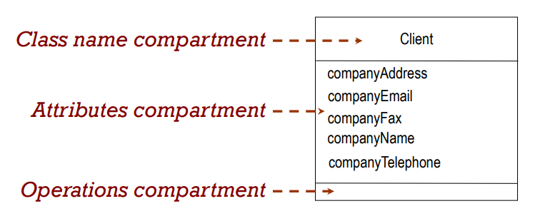
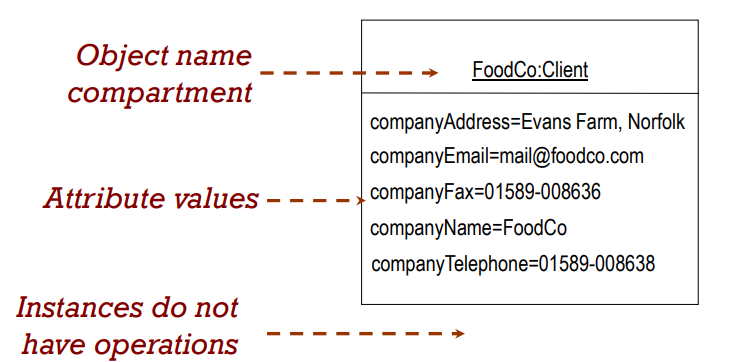
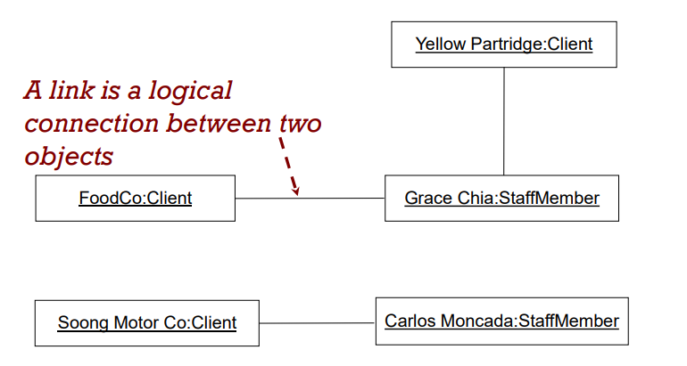
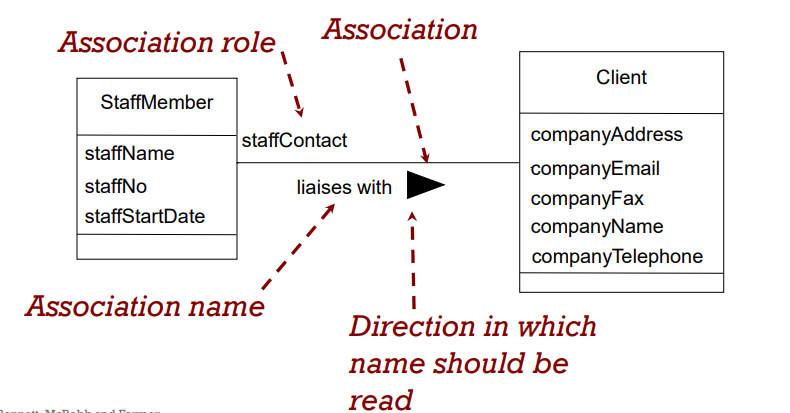
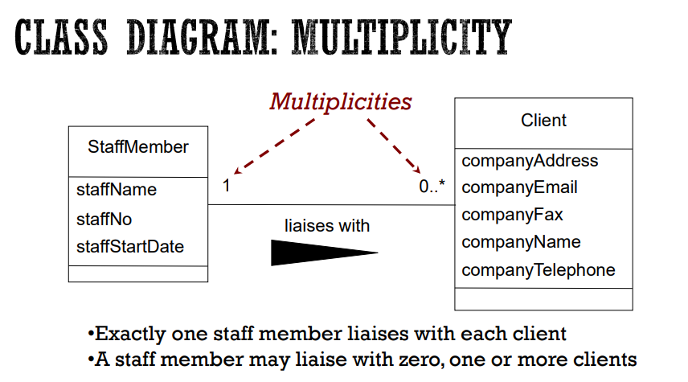

# Class Diagram

[back](../index.md)

[toc]

---

## Class Diagram: Class Symbol

- A Class is “a description of a set of objects with similar features, semantics and constraints” (OMG, 2009)

---

## Class Diagram: Instance

- An object (instance) is: “an abstraction of something in a problem domain…”

---

## Class Diagram: Attributes

- Attributes are:
  - Part of the essential description of a class
  - The common structure of **what the class can ‘know’**
  - Each object has its own value for each attribute in its class:
    - Attribute=“value”
    - companyName=FoodCo

---

## Class Diagram: Associations

- Associations represent:
  - The possibility of a **logical relationship or connection** between objects of one class and objects of another
    - “Grace Chia is the staff contact for FoodCo”
    - An employee object is linked to a client object
  - If two objects are linked, their classes are said to have an association

## Class Diagram: Links

---

## Class Diagram: Associations

---

## Class Diagram: Multiplicity

- Associations have multiplicity: the range of permitted cardinalities of an association
- Represent enterprise (or business) rules
- These always come in pairs:
  - Associations must be read separately from both ends
  - Each bank customer may have 1 or more accounts
  - Every account is for 1, and only 1, customer

---

## Class Diagram: Operations

- Operations are:
  - An essential part of the description of a class
  - The **common behaviour** shared by all objects of the class
  - **Services** that objects of a class can provide to other objects

---

[TOP](#class-diagram)
