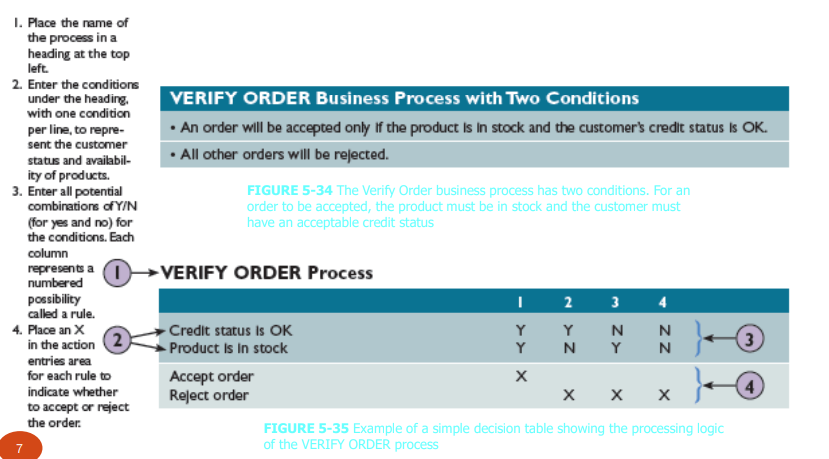
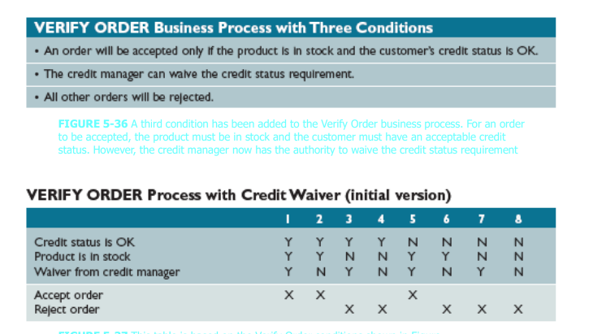
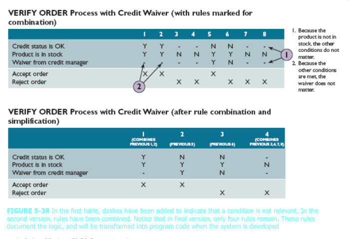
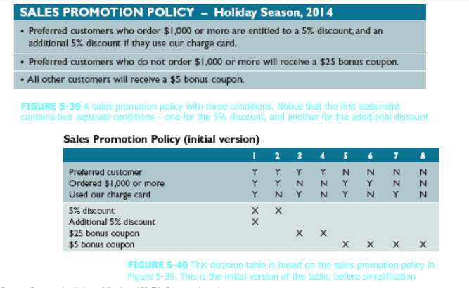
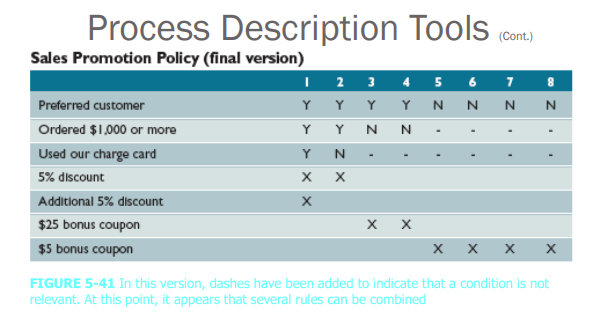
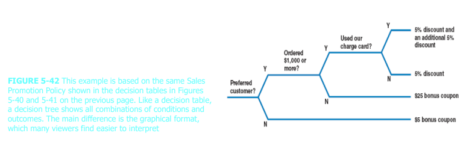

[Back](../index.md)

# Specifying Operations

[TOC]

---

## Purpose of Specifying Operations

- From **analysis** perspective: Ensure users' needs are understood

- From **design** perspective: Guide programmer to an appropriate implementation (i.e. method)

- From **test** perspective: Verify that the method does what was originally intended

---

## Types of Logic Specification

**Logic description** is probably the most important element

- Two main categories:
  - **Non-algorithmic methods** focus on **what** the operation should achieve—black box approach(testing a system with no prior knowledge of its internal workings.)
  - **Algorithmic** types focus on **how** the operation should work —white box approach

---

## Decision Table

- Many variants, but all work by identifying:
    - Combinations of **initial conditions** = 'rules' 
    - **Outcomes** that should result <u>depending on what conditions are true</u> = 'actions'

- Rules and actions are displayed in **tabular** form


- Shows a logical structure, with all possible combinations of conditions and resulting actions
- It is important to consider every possible outcome to ensure that you have **overlooked nothing**
- The number of rules **doubles** each time you **add a condition**
- Can have more than two possible **outcomes**
- Often are the best way to describe a **complex set** of conditions

### Example 1


1. 左上角写name of process
2. 第一列写条件
3. 根据condition列出可能的rule
4. 根据outcome列出可能action

### Example 2



- 相比前一例，有3个条件，则有8个rule



- 简化

### Example 3






### 总结

- Condition
    - 关键词: when, if
    - 连接词and: 两个条件
    - 条件一般是true/false
    - 如果是值，则对逐个值进行true/false判断.

- Rule
    - 如果有n个条件则rule数量是2<sup>n</sup>
        eg: condt=2，rule=4; condt=3, rule=8;

- Action
    - if true, outcome = action
    - 蕴含not outcome也是action之一.当outcome复杂时，选有意义的action

- Simplify
    1. 按自然语言对condition分组，通常一个自然句为一组
    2. 对组内的条件进行验证:
        - 逐一验证条件，当条件为非时，组内其他条件是否有存在意义。 
    3. 对组间的条件进行验证
        - 当该组条件为非时，他组条件是否有存在意义。
    4. 没有意义的，使用`-`表示
    5. 合并combine没有意义的rule为一个rule。

--- 

## Decision Tree

- Graphical representation of the conditions, actions, and rules found in a decision table
- Show the logic structure **in a horizontal form** that resembles a tree with the roots at the left
and the branches to the right
- Decision trees and decision tables provide the same results, but in different forms



---

## Structured English

- Three types of control structure, derived from structured programming:
    - Sequences of instructions 序列
    - Selection of alternative instructions (or groups of instruction) 选择
    - Iteration (repetition) of instructions (or groups) 迭代

### Sequence in Structured English

 Each instruction is executed in turn, one after another:

```
get client contact name
sale cost = item cost * ( 1 - discount rate )
calculate total bonus
description = new description
```

### Selection in Structured English

按条件选择
- One or other alternative course is followed, depending on result of a test:

```
if client contact is 'Sushila'
    set discount rate to 5%
else
    set discount rate to 2%
end if
```

### Iteration in Structured English

循环迭代

-  Instruction or block of instructions is repeated
    - Can be a set number of repeats
    - Or until some test is satisfied:

```
do while there are more staff in the list
    calculate staff bonus
    store bonus amount
end do
```

### Structured English: Arbitrarily Complex

```
do while there are more staff in the list
    calculate bonus for this staff member
    begin case
        case bonus > £250
            add name to ‘star of month’ list
        case bonus < £25
            create warning letter
    end case
    store bonus amount
end do
format bonus list
do while there are more adverts for campaign
    get next advert
    get cost for this advert
    add to cumulative cost for campaign
end do
set total advert cost = final cumulative cost
set total campaign cost = total advert cost + (total advert cost X overhead rate)
get campaign budget
if total campaign cost > campaign budget
    generate warning
endif
```

---

[TOP](#specifying-operations)
