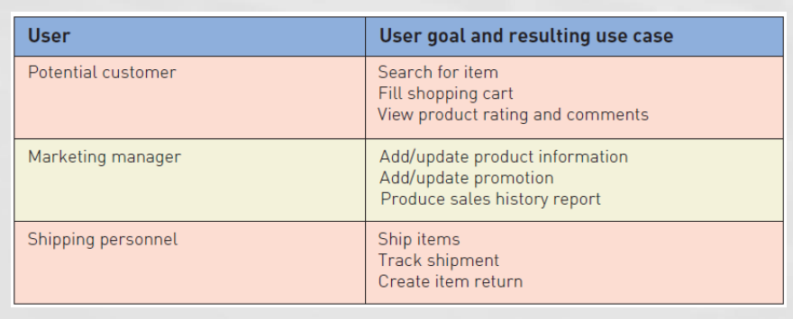
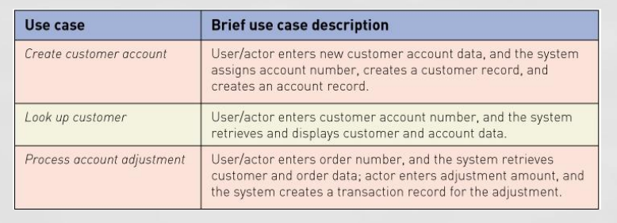
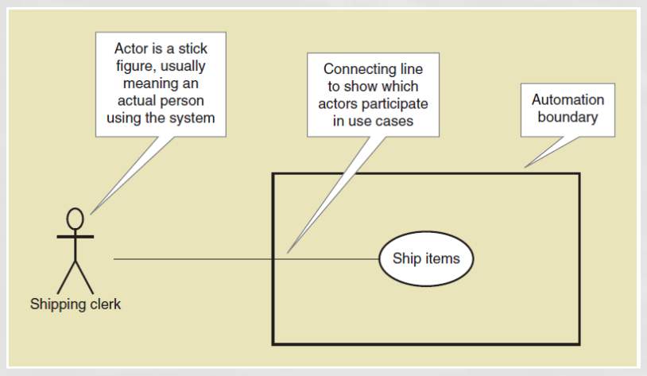

[Back](../index.md)

# Use Stories and Use cases

[TOC]

---

## User Story

- A **User Story** is a **one-sentence description** of a work-related task done by _a user_ to achieve some <u>goal or result</u>.

Acceptance Criteria identify the **features that must be present** at the completion of the task

- The template for a user story description is:<br>

```
"As a <role> I want to <goal> so that <benefit>"
```

---

## Use Cases

- **Use case** — an activity that the system performs, usually **in response to a request** by a use. <br> 用例是用来回应由用户发起的请求,因此与用户的目的 goal 有关.

- Use cases define functional requirements

- Analysts decompose(分解) the system into a set of use cases (functional decomposition)

- Name each use case using **Verb-Noun** <br>用例是动-名结构

- Two techniques for Identifying use cases
  - User **goal** technique
  - **Event decomposition** technique

### User Goal Technique

- Identify all of the **potential categories of users** of the system

- Interview and ask them to **describe the tasks** the computer can help them with

- Probe further to refine the tasks into specific **user goals**, e.g.:"I need to Ship items, Track a shipment, Create a return"



- Steps
  1. Identify all the **potential users** for the new system
  2. **Classify** the potential users in terms of their <u>functional role</u> (e.g., shipping, marketing, sales)
  3. Further classify potential users by <u>organizational level</u> (e.g., operational, management, executive)
  4. For each type of user, **interview** them to find a list of specific goals they will have when using the new system (current goals and innovative functions to add value)
  5. Create a **list of preliminary use cases** organized by type of user
  6. Look for duplicates with similar use case names and **resolve inconsistencies**
  7. Identify where different types of users **need the same use cases**
  8. Review the completed list with each _type of user_ and then with _interested stakeholders_

---

### Event Decomposition Technique

- Identify the **events** that occur to which the **system must respond**.
  <br>For each event, name a use case (verb-noun) that describes what the system does when the event occurs

- **Event**– something that **occurs** at a specific time and place, can be described, and should be remembered **by the system**

- Types of Events

  - **External Event**: an event that occurs **outside the system**, usually _initiated by an external agent or actor_ 外部,一般是用户触发
  - **Temporal(时间的) Event**: an event that occurs as a result of _reaching a point in time_
  - **State Event**: an event that occurs when something happens **inside the system** that triggers some process 内部触发

- Steps:

  1. Consider the **external events** in the system environment that require a response from the system by using the External Event Checklist.
  2. For each external event, identify and **name the use case** that the system requires
  3. Consider the **temporal events** that require a response from the system by using the Temporal Event Checklist
  4. For each temporal event, identify and **name the use case** that the system requires and then **establish the point of time** that will trigger the use case
  5. Consider the **state events** that the system might respond to, particularly if it is a real-time system in which devices or **internal state changes** trigger use cases.
  6. For each state event, identify and name the use case that the system requires and then **define the state change**.
  7. When events and use cases are defined, check to see if they are required by using the **perfect technology assumption**. Do not include events that involve such system controls as login, logout, change password, and backup or restore the database, as these are put in later.

- Benefits
  - Events are **broader than user goal**: Capture temporal and state events
  - Help decompose at the **right level** of analysis: an elementary business process (EBP 基本业务流程)<br>
    EBP is a fundamental business process performed by one person, in one place, in response to a business event
  - Uses **perfect technology assumption** to make sure functions that support the users work are _identified_ and not additional functions for security and system controls

---

#### External Event Checklist

- External agent or actor _wants something_ resulting in a **transaction**
  e.g.: Customer buys a product
- External agent or actor wants some **information**
  e.g.: Customer wants to know product details
- External data changed and needs to be **updated**
  e.g.: Customer has new address and phone
- Management wants some **information**
  e.g.: Sales manager wants update on production plans

#### Temporal Event Checklist

- Internal outputs needed **at points in time** 时间触发的, 源自内部需求.
  <br>e.g.:
  Management reports (summary or exception)
  Operational reports (detailed transactions)
  Internal statements and documents (including payroll)

- External outputs needed **at points of time** 时间触发的,源自外部需求
  <br>e.g.: Statements, status reports, bills, reminders

---

#### Perfect Technology Assumption

Don’t worry about functions built into system because of limits in technology and people. Wait until design.

---

### Brief Use Case Description

**Brief use case description** is often a <u>one sentence description</u> showing the main steps in a use case



---

## Use case diagram

- **Use case diagram**: a UML model used to graphically show uses cases and their relationships to actors<br>
  Recall UML is Unified Modeling Language, the standard for diagrams and terminology for developing information systems<br>
  help to capture the requirements of the system. These diagrams also identify the interactions between the system and its actors. 

- **Actor** is the UML name for a **end user**

- **Automation boundary**: the **boundary** between the computerized portion of the <u>application</u> and the <u>users</u> who operate the application



- A relationship between use cases where one use case is stereotypically **included within** the other use case— like a called subroutine(子程序). Arrow points to subroutine <br>不建议使用

- Usefult link:
  - [use case diagram(visual-paradigm)](https://www.visual-paradigm.com/guide/uml-unified-modeling-language/what-is-use-case-diagram/)
  - [Use-case diagrams - IBM Documentation](https://www.ibm.com/docs/en/rsar/9.5?topic=diagrams-use-case)

- Benefits: Use-case diagrams are helpful in the following situations:
  - Before <u>starting a project</u>, you can create use-case diagrams to model a business so that all participants in the project **share an understanding** of the workers, customers, and activities of the business.
  - While <u>gathering requirements</u>, you can create use-case diagrams to **capture the system requirements** and to present to others **what the system should do**.
  - During the <u>analysis and design phases</u>, you can use the use cases and actors from your use-case diagrams to **identify the classes** that the system requires.
  - During the <u>testing phase</u>, you can use use-case diagrams to **identify tests** for the system.


- Steps:
    1. Identify all the <u>stakeholders and users</u> who would benefit by seeing a use case diagram
    2. Determine **what each stakeholder or user needs to review** in a use case diagram: each subsystem, for each type of user, for use cases that are of interest 决定必要包含的item
    3. For each potential communication need, **select the use cases and actors** to show and draw the use case diagram. There are many software packages that can be used to draw use case diagrams
    4. Carefully **name each use case diagram** and then note how and when the diagram should be used to review use cases with stakeholders and users

---

[TOP](#use-stories-and-use-cases)
