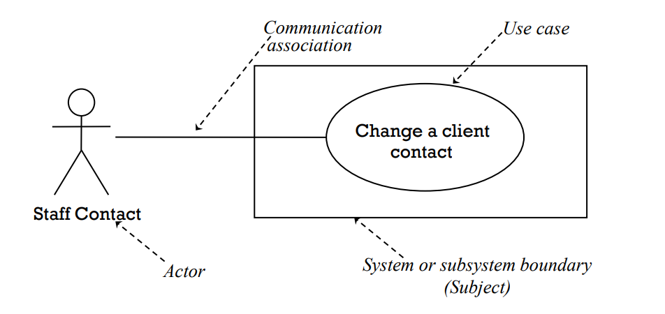
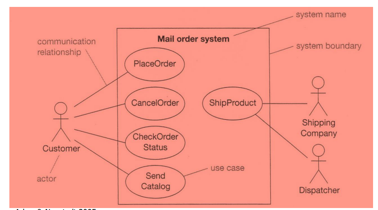

[Back](../index.md)

# Use Case Diagram

[TOC]

---

## Purpose of Use Case Diagrams

- document the **functionality of the system** <u>from the users' perspective</u>  
    Use cases represent only the **functional requirements of a system**.
- document the scope of the system
- document the **interaction** between the users and the system using supporting use case descriptions (behaviour specifications) 

## Notation of Use Case Diagrams

- The Use Case Model consists of the following:
    - Actors 人
    - Use cases 目的
    - Relationships 关联
    - System boundary 边界

- Steps of use case modeling:
    - Find the system boundary
    - Find the actors
    - Find the use cases:
        - Specify the use cases
        - Create scenarios

### Actors

- An actor is a role taken by an **external entity** when **interacting** with the system directly

- An actor:
    - Is always external to the system 是系统外的实体，包括人和time
    - Interacts directly with the system 是直接与系统交互的
    - Represents a role played by people or things, not specific people or specific things

 Drawing Actors

- drawn as stick people with a name
- the roles that people, other systems or devices take when communicating with a particular use case or use cases 角色
- not the same as job titles or people 
- people with one job title may play the roles of several actors 多重角色
- one actor may represent several job titles

---

### Use cases

According to Rumbaugh, a use case is “a specification of sequences of actions, including variant sequences and error sequences, that a system, subsystem, or class can perform by **interacting** with outside actors”

- Use cases: 即actor与system的互动
    - Are always started by an actor 由actor发起
    - Are always written from an actor’s point of view 从actor着眼

 Drawing use cases

- drawn as ellipses(椭圆) with a name in or below each ellipse
- describe a sequence of actions that the system performs to achieve an observable **result of value to an actor** **对actor有价值的结果**
- the name is usually an active verb and a noun phrase 动词+名词
    - Names of use cases should be verb phrases

---

### Communication associations

- line drawn between an actor and a use case
- represent communication link between an instance of the **use case** and an instance of the **actor**

---

### Subjects (subsystems)

- drawn as a rectangle around a group of use cases that belong to the same subject 矩形画边界
- in a CASE tool, use cases for different subjects are usually placed in separate use
case diagrams

---

### Use Case Descriptions

- Can be a simple paragraph
- Can be a step-by-step breakdown of interaction between actor and system

## Example

---

[TOP](#use-case-diagram)
